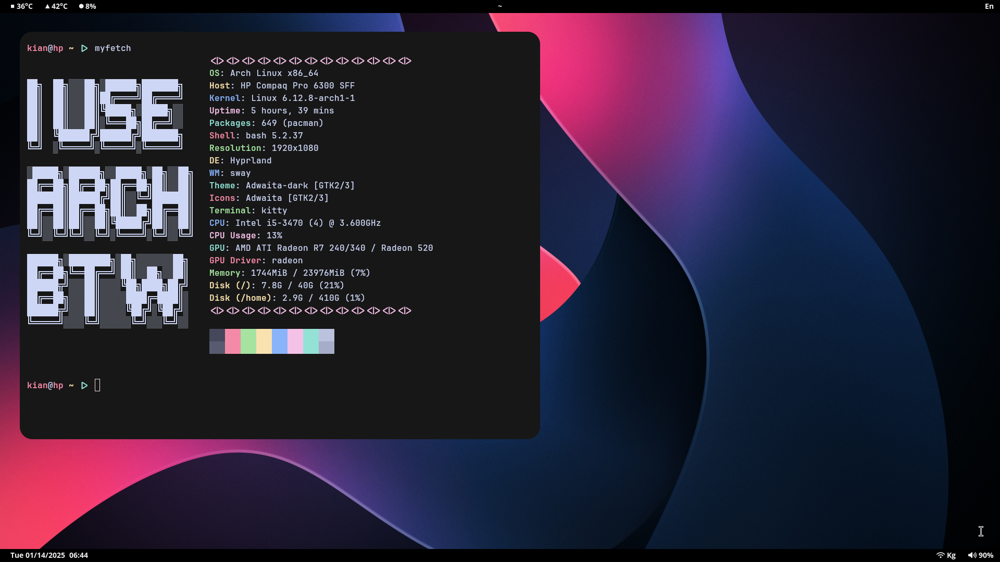

# Hyprland Dotfiles
Simple and Minimal Hyprland Setup.
## Screenshot

## Contents
This repository contains the following configuration files:
* Hyprland (hyprland.conf)
* Waybar (config.jsonc, styles.css)
* Bash (.bashrc)
## How to Install
The installation process is quite easy. First you need to clone the repository into a local path:
```
  github clone https://github.com/kay-ng/hyprland-dotfiles/
```
